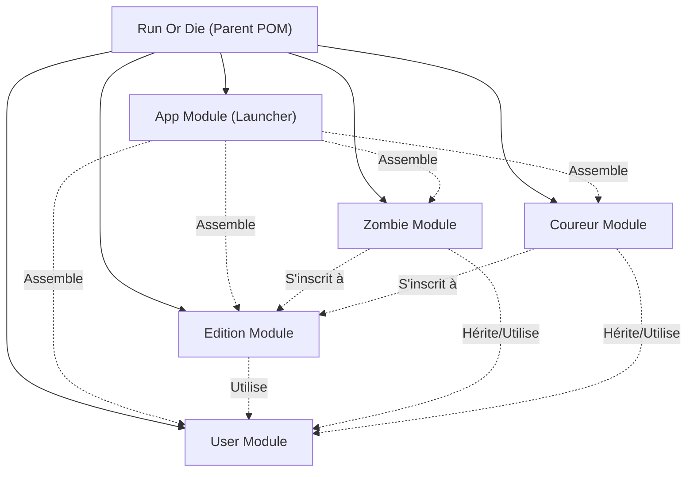
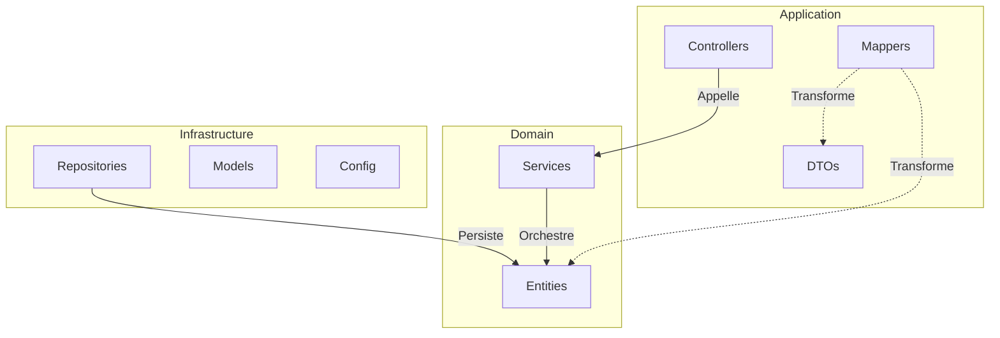
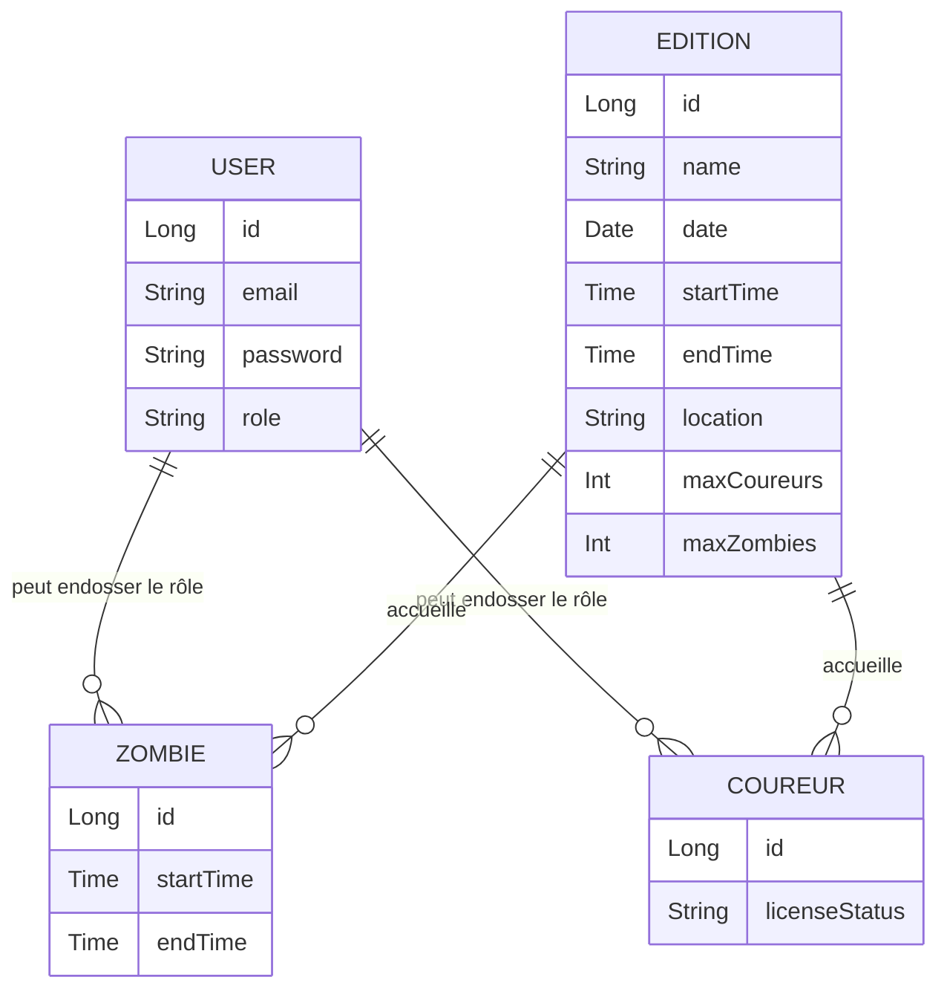

# Run or Die 🧟

Backend d'une application pour gérer des éditions d'événements sportifs décalés : les zombie runs.

## Équipe
- Victor Agahi (victor.agahi@epita.fr)
- Clément Pasteau (clement.pasteau@epita.fr)
- Victor Giroud (victor.giroud@epita.fr)
- Damien Lugagne-Delpon (damien.lugagne-delpon@epita.fr)

## Lancement et Déploiement

L'application est construite avec Maven.

Pour compiler le projet et générer l'archive finale :
```bash
mvn clean install
```
Cette commande va :
1. Compiler tous les modules de l'application.
2. Générer le *fat-jar* auto-exécutable.
3. Copier automatiquement ce jar dans le dossier `/jar` situé à la racine du projet.

Pour lancer l'application (une fois compilée) :
```bash
java -jar jar/run-or-die-1.0.0-SNAPSHOT.jar
```

## Configuration de Sécurité

L'authentification utilise des jetons JWT (HS256). Pour fonctionner localement, vous devez configurer les variables d'environnement `JWT_SECRET_KEY` et `JWT_EXPIRATION`.

### Setup Rapide

Un script de configuration est fourni pour générer automatiquement une clé sécurisée et créer votre fichier `.env` :

```bash
# Rendre le script exécutable (si ce n'est pas déjà fait)
chmod +x setup-env.sh

# Lancer le setup
./setup-env.sh
```

Le script va créer un fichier `.env` à la racine du projet contenant :
- `JWT_SECRET_KEY` : Une clé de 256 bits générée aléatoirement et encodée en Base64.
- `JWT_EXPIRATION` : La durée de validité du token (24h par défaut).

> **Note** : Le fichier `.env` est ignoré par Git. Ne le commitez jamais.

### Configuration Manuelle

Si vous préférez configurer les variables manuellement (dans votre IDE ou votre terminal) :
1. Générez une clé : `openssl rand -base64 32`
2. Définissez les variables :
   - `JWT_SECRET_KEY=votre_cle_generee`
   - `JWT_EXPIRATION=86400000`

## Accès et Données de Test

Le jeu de données initial charge automatiquement deux utilisateurs en mémoire :
- **Organisateur** : `mastermind@epita.fr` / `brains`
- **Coureur** : `forrest@epita.fr` / `run`

Une fois l'application démarrée, l'interface **Swagger** pour explorer et tester l'API est accessible à l'adresse suivante :
[http://localhost:8080/swagger-ui.html](http://localhost:8080/swagger-ui.html)

## Architecture Modulaire et DDD

Le projet est divisé en 5 modules Maven représentant les différents domaines fonctionnels et l'assemblage de l'application :



Chaque module respecte une architecture **Clean Code / DDD** stricte avec les couches suivantes :
- **`application`** : `controllers`, `dtos` (`requests` et `responses`), `mappers`. Couche d'exposition et d'interaction avec l'extérieur.
- **`domain`** : `entities` (objets métier) et `services` (logique métier). Cœur isolé des frameworks externes.
- **`infrastructure`** : `repositories` (accès aux données), `models` (modèles de persistance) et configuration.

### Les "Services" : Domaine vs Infrastructure
Dans cette architecture, le concept de **Service** se divise en deux rôles distincts :
1. **Services du Domaine** (`domain/services/`) : Ils contiennent les règles métiers pures (ex: validation des horaires, gestion des conflits). Ils sont **100% agnostiques** (ne dépendent d'aucun framework technique) et utilisent des *Ports* (interfaces) pour interagir avec l'extérieur.
2. **Services de l'Infrastructure** (`infrastructure/services/`) : Ce sont les *Adapters* (les implémentations techniques des ports). Ils contiennent la "plomberie" (ex: accès base de données, algorithme de hash Bcrypt, appels API REST externes). Cette stricte séparation garantit que la logique métier peut être testée unitairement et ne dépend pas des choix techniques de l'infrastructure.



## Modèle de Données (Prévisionnel)



## Stack Technique
- Java 21
- Spring Boot > 3.0
- H2 Database (in-memory)
- OpenAPI (Swagger UI)
- Maven (Multi-modules)
